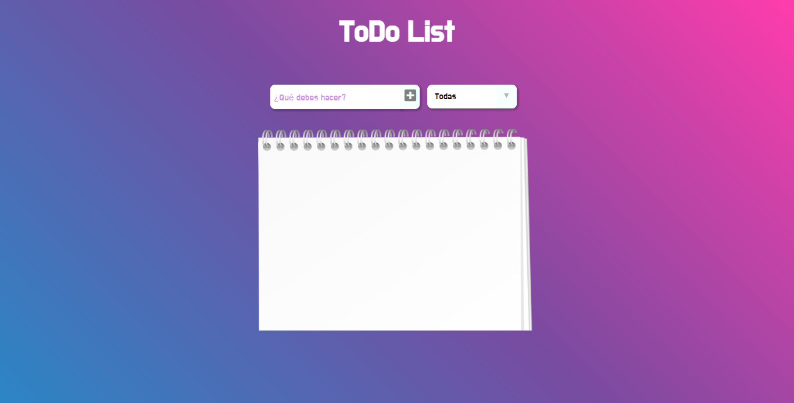

# To-Do List by Mariana 📋✏️
### Aplicacion que permite crear una lista de tareas, marcar las que fueron completadas ✅ y eliminar las que no desees tener en la lista 🗑️.
### Proyecto realizado como evaluación final del septimo modulo del curso desarrollo FrontEnd, utilizando **Reactjs**.

 

## Haciendo click 🖱️ [aquí](https://maricaroj.github.io/to-do-list/) puedes verlo andar y armar tu lista de tareas!

📌 ***Este proyecto utiliza las siguientes dependencias:*** 

📁 [ReactJs](https://es.reactjs.org/)
 
📁 [Firebase](https://firebase.google.com/)

  

---
Hecho con mucho amor por [Mí](https://github.com/maricaroj)💛💙❤️